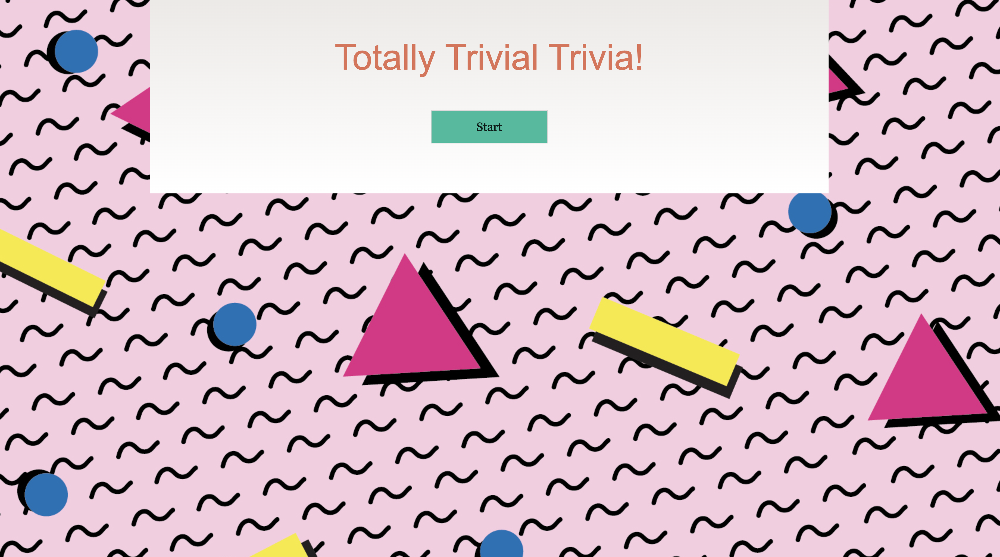
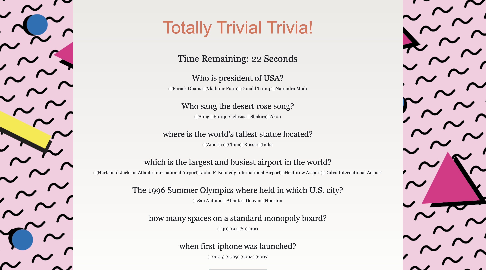
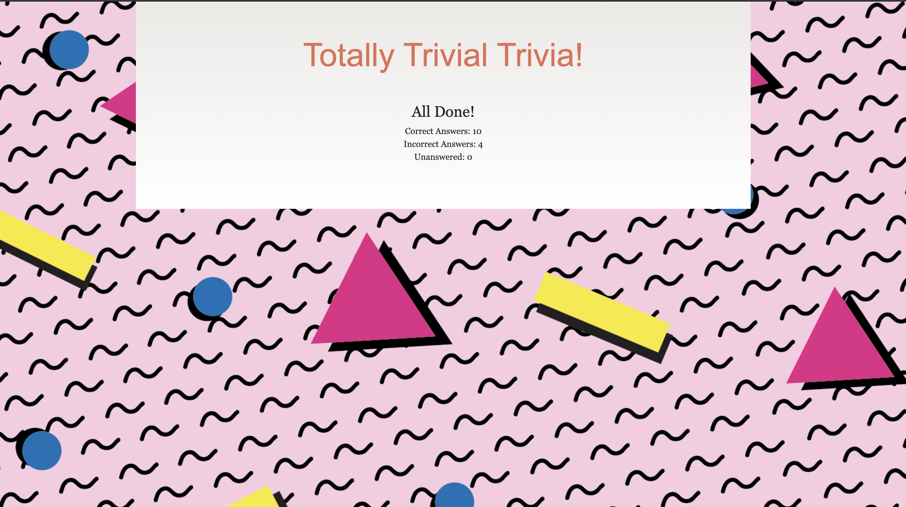

### Totally Trivial Trivia!

This word guessing game is set with a music artist name

## Live

https://dhavalpatel0513.github.io/TriviaGame/

## Screenshots

## Technologies used to create site

<li>HTML5</li>
<li>CSS</li>
<li>Bootstrap</li>
<li>Javascript</li>
<li>JQuery</li>

### How to Play

1. Created a Trivia game using JavaScript for the logic and jQuery to manipulate HTML. seven questions randomly generated with countdown timer for answer. After seven questions, app will display score with the option to restart the game.
   
## Feedback

Feature requests are always welcome. If you wish to contribute, please send an email with your request to (dhavalpatel0513@gmail.com) for discuss. or <a href="https://github.com/dhavalpatel0513/TriviaGame/issues/" target="_blank">  file an issue</a>.

